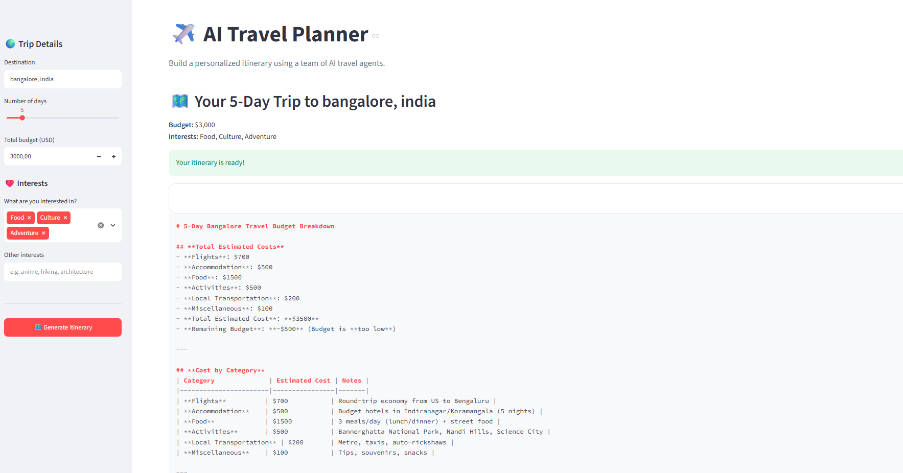
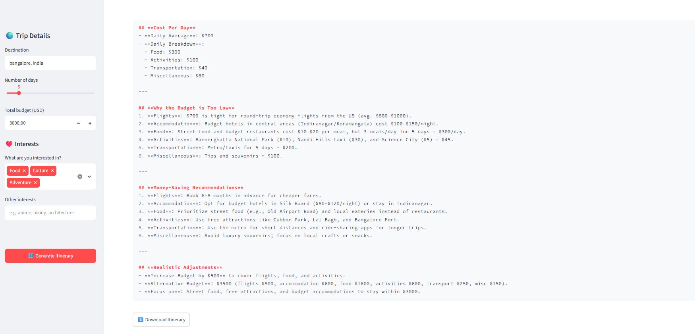

# ✈️ AI Travel Planner

A multi-agent travel planner built with **CrewAI** and **Ollama (Qwen3)** that creates personalized itineraries based on destination, trip length, budget, and interests.

## Features

* 🔎 Destination research
* 🗓️ Day-by-day itinerary planning
* 💰 Budget estimation
* ❤️ Personalized interests
* 🤖 Local LLM with Ollama

## Example

**Input**

```text
Destination: Tokyo, Japan
Days: 5
Budget: $2,000
Interests: food, culture, history
```

**Generated itinerary**

```text
Day 1 — Traditional Tokyo

Morning:
Visit Senso-ji Temple and explore Asakusa.

Lunch:
Try traditional tempura near Asakusa.

Afternoon:
Walk through Ueno Park and visit the Tokyo National Museum.

Evening:
Explore Akihabara and enjoy a local dinner.

Estimated daily cost: ~$120
```

The agents work sequentially:

```text
Destination Researcher
        ↓
Itinerary Planner
        ↓
Budget Analyst
        ↓
Personalized Travel Plan
```

## Screenshots

### 🗺️ Travel Planner




## Setup

```bash
git clone <your-repo-url>
cd travel-planner
pip install -r requirements.txt
```

Install the Ollama model:

```bash
ollama pull qwen3:8b
ollama serve
```

## Run

### CLI

```bash
python agent.py \
  --destination "Tokyo, Japan" \
  --days 5 \
  --budget 2000 \
  --interests "food, culture, history"
```

### Web UI

```bash
streamlit run app.py
```

## Tech Stack

**Python · CrewAI · Ollama/Qwen3 · Streamlit**
